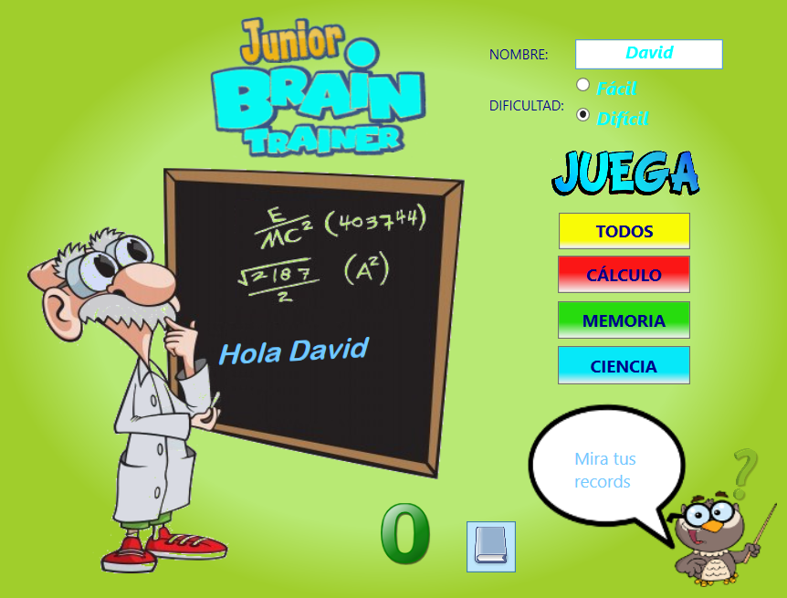
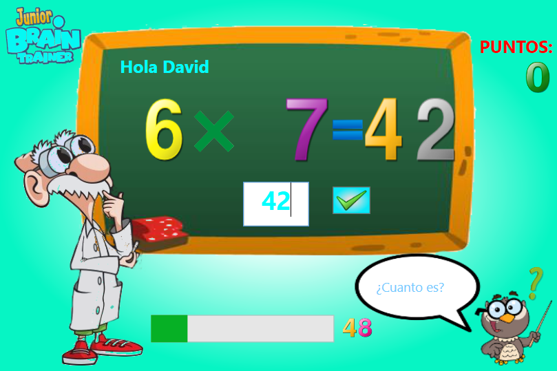
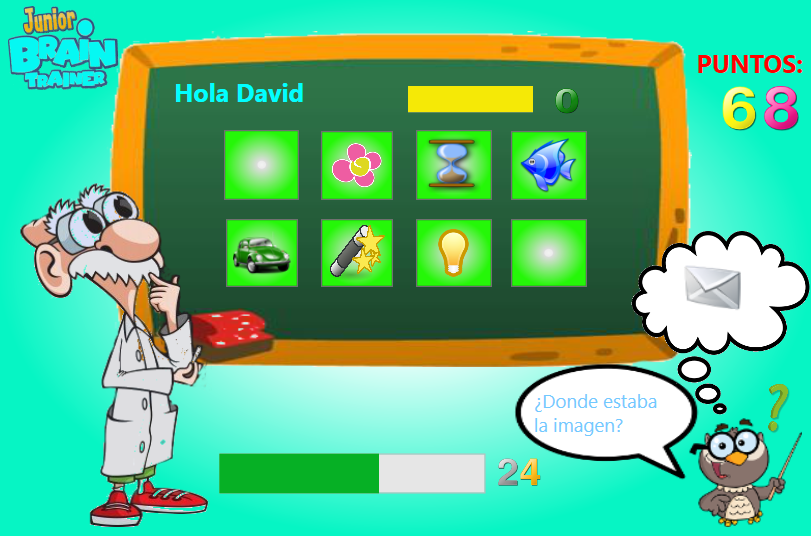
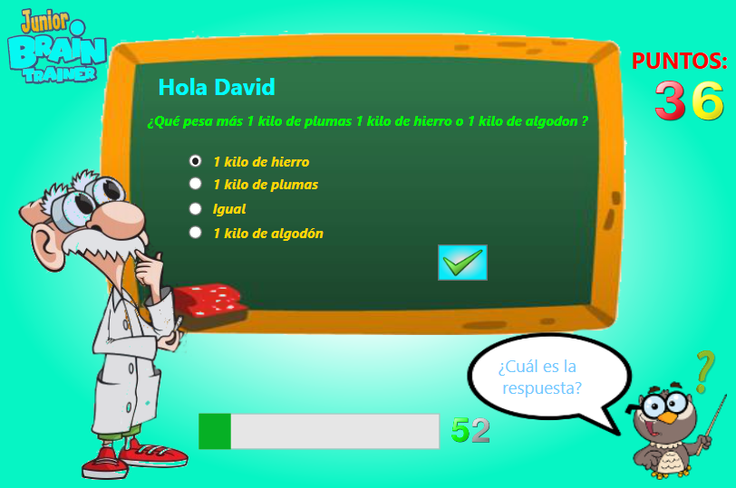

# BrainChild
Fun game to exercise the mind with simple but entertaining exercises. Suitable for children and adults thanks to the different difficulties. You can exercise your calculation skills, memory or knowledge.

## Technologies
Proyect is created with:
* Visual Studio 2010
* Microsoft Framework .NET v4
* Expresision Blend 2

## Application

<table>
  <tr>
    <td></td>
    <td></td>
  </tr>
  <tr>
    <td></td>
    <td></td>
  </tr>
 </table>